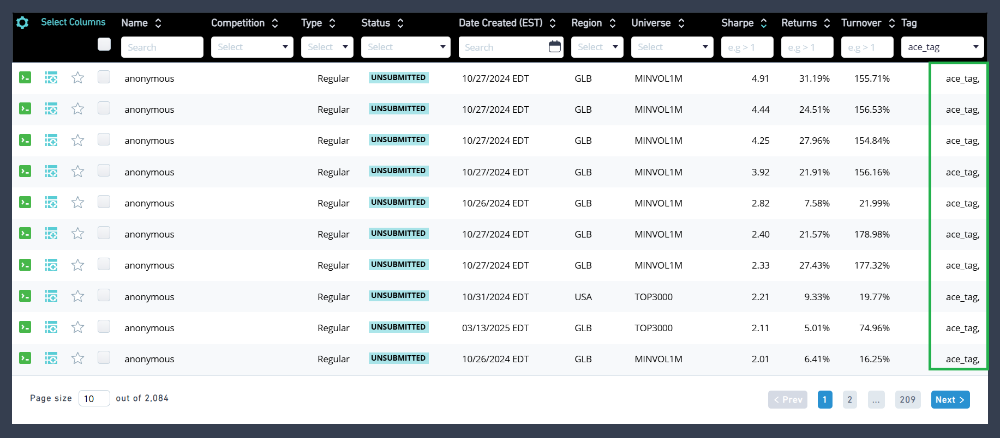

# Ace-api-WQ 🧠 – Alpha Research Project for WorldQuant Brain

This repository contains the notebook that helped in creating my alphas that were submitted for the **WorldQuant Brain Consultant Challenge (September 2024)**.

## 📌 Project Summary

Developed a machine framework to design, test, and evaluate alpha signals using the **WorldQuant Brain API**. The framework supported scalable backtesting across multiple global equity datasets and enabled efficient experimentation with signal logic.
The alphas simulated using the api can be checked directly in the alphas section of your wq account and you will see a ace tag associated with this alphas.

## 📊 Key Highlights

- Created and simulated **35+ alphas** using model and analyst datasets.
- Backtested on both **US and Global equity markets** to evaluate out-of-sample performance.
- Utilized **Python**, including libraries such as `itertools`, and Brain-provided utilities (`ace_lib`, `helpful_functions`) for alpha simulation.
- Designed for rapid iteration, results logging, and comparative analysis of alpha effectiveness.
- Focused on **signal quality and diversity**, avoiding overfit metrics like IS statistics.
- Here is a screenshot of some of the alphas that were simulated using this project.
  

## 📂 Contents

- `ace-api/` – Code for running simulations via the Brain API.
- `results/`- Includes selected screenshots showcasing the performance of alphas developed and submitted using this framework.

## 📈 Outcome

This project was part of a successful attempt in the Consultant Challenge which helped me to achieve rank 1 in the hackathon.

---

## 🔒 Disclaimer

Due to WorldQuant Brain’s data and file policy, key files such as `ace_lib.py`, `helpful_functions.py`, and `requirements.txt` are not included in this repository.

---

## 📬 Contact

Feel free to reach out if you're interested in quantitative research, finance, or alpha modeling.

📧 Email: strangemridul [at] gmail [dot] com

